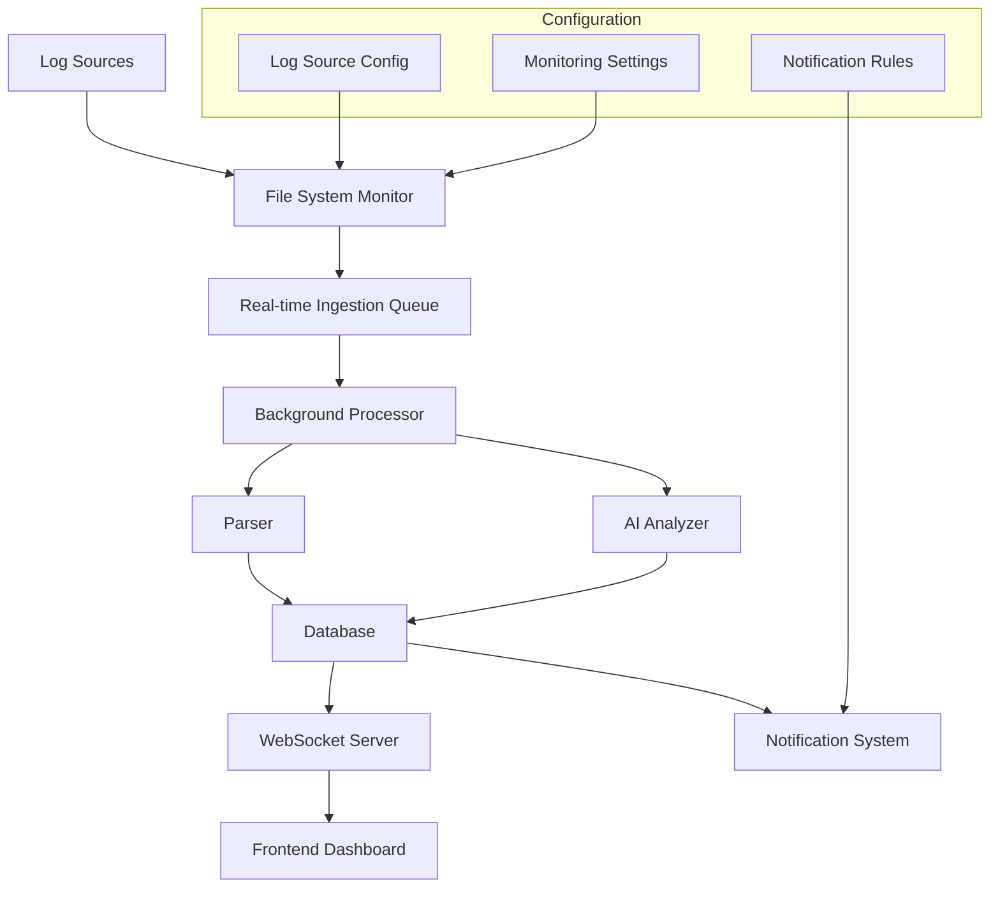

# Design Document

## Overview

The real-time log autodetection and decoding feature transforms ThreatLens from a reactive to a proactive security monitoring system. This feature continuously monitors configured log sources, automatically detects new log entries, and processes them through the complete analysis pipeline in real-time. The system uses file system monitoring, WebSocket connections for real-time updates, and an enhanced background processing system to provide immediate threat detection and response capabilities.

## Architecture

### High-Level Architecture



### Component Architecture

The system extends the existing ThreatLens architecture with the following new components:

1. **File System Monitor**: Watches configured log files and directories for changes
2. **Real-time Ingestion Queue**: Manages incoming log entries with priority handling
3. **WebSocket Server**: Provides real-time updates to the frontend
4. **Configuration Manager**: Handles log source configuration and monitoring settings
5. **Notification System**: Sends alerts for high-priority events
6. **Health Monitor**: Tracks system health and performance metrics

## Components and Interfaces

### 1. File System Monitor (`app/realtime/file_monitor.py`)

**Purpose**: Monitor log files and directories for changes using OS-level file system events.

**Key Classes**:
- `LogFileMonitor`: Main monitoring class using `watchdog` library
- `LogSourceConfig`: Configuration for individual log sources
- `FileChangeEvent`: Event data structure for file changes

**Interfaces**:
```python
class LogFileMonitor:
    def __init__(self, config_manager: ConfigManager)
    async def start_monitoring(self) -> None
    async def stop_monitoring(self) -> None
    def add_log_source(self, source_config: LogSourceConfig) -> bool
    def remove_log_source(self, source_path: str) -> bool
    def get_monitoring_status(self) -> Dict[str, Any]

class LogSourceConfig:
    path: str
    enabled: bool
    polling_interval: float
    file_pattern: Optional[str]
    recursive: bool
    source_name: str
```

### 2. Real-time Ingestion Queue (`app/realtime/ingestion_queue.py`)

**Purpose**: Manage incoming log entries with priority queuing and batch processing.

**Key Classes**:
- `RealtimeIngestionQueue`: Async queue with priority handling
- `LogEntry`: Individual log entry with metadata
- `QueueProcessor`: Processes queued entries in batches

**Interfaces**:
```python
class RealtimeIngestionQueue:
    async def enqueue_log_entry(self, entry: LogEntry) -> None
    async def process_queue(self) -> List[ProcessingResult]
    def get_queue_stats(self) -> Dict[str, Any]
    async def start_processing(self) -> None
    async def stop_processing(self) -> None

class LogEntry:
    content: str
    source_path: str
    source_name: str
    timestamp: datetime
    priority: int
    file_offset: int
```

### 3. WebSocket Server (`app/realtime/websocket_server.py`)

**Purpose**: Provide real-time updates to connected frontend clients.

**Key Classes**:
- `WebSocketManager`: Manages WebSocket connections and broadcasts
- `EventBroadcaster`: Handles event broadcasting to clients
- `ConnectionManager`: Manages client connections and subscriptions

**Interfaces**:
```python
class WebSocketManager:
    async def connect(self, websocket: WebSocket, client_id: str) -> None
    async def disconnect(self, client_id: str) -> None
    async def broadcast_event(self, event: EventUpdate) -> None
    async def send_to_client(self, client_id: str, message: dict) -> None
    def get_connected_clients(self) -> List[str]

class EventUpdate:
    event_type: str  # 'new_event', 'analysis_complete', 'system_status'
    data: Dict[str, Any]
    timestamp: datetime
    priority: int
```

### 4. Configuration Manager (`app/realtime/config_manager.py`)

**Purpose**: Manage log source configurations and monitoring settings.

**Key Classes**:
- `ConfigManager`: Central configuration management
- `MonitoringConfig`: Global monitoring settings
- `NotificationConfig`: Notification rules and settings

**Interfaces**:
```python
class ConfigManager:
    def load_config(self) -> MonitoringConfig
    def save_config(self, config: MonitoringConfig) -> bool
    def add_log_source(self, source_config: LogSourceConfig) -> bool
    def remove_log_source(self, source_path: str) -> bool
    def update_log_source(self, source_path: str, config: LogSourceConfig) -> bool
    def get_log_sources(self) -> List[LogSourceConfig]

class MonitoringConfig:
    log_sources: List[LogSourceConfig]
    processing_batch_size: int
    max_queue_size: int
    notification_rules: List[NotificationRule]
    health_check_interval: int
```

### 5. Enhanced Background Processor (`app/realtime/enhanced_processor.py`)

**Purpose**: Extended background processing with real-time capabilities and WebSocket integration.

**Key Features**:
- Real-time processing pipeline integration
- WebSocket event broadcasting
- Enhanced error handling and retry logic
- Performance monitoring and metrics

**Interfaces**:
```python
class EnhancedBackgroundProcessor:
    def __init__(self, websocket_manager: WebSocketManager)
    async def process_realtime_entry(self, entry: LogEntry) -> ProcessingResult
    async def broadcast_processing_update(self, result: ProcessingResult) -> None
    def get_processing_metrics(self) -> Dict[str, Any]
```

### 6. Notification System (`app/realtime/notifications.py`)

**Purpose**: Send notifications for high-priority events through multiple channels.

**Key Classes**:
- `NotificationManager`: Central notification handling
- `NotificationChannel`: Abstract base for notification channels
- `EmailNotifier`, `SlackNotifier`, `WebhookNotifier`: Specific channel implementations

**Interfaces**:
```python
class NotificationManager:
    def add_channel(self, channel: NotificationChannel) -> None
    async def send_notification(self, event: EventResponse, severity: int) -> None
    def configure_rules(self, rules: List[NotificationRule]) -> None
    def get_notification_history(self) -> List[NotificationRecord]

class NotificationRule:
    min_severity: int
    max_severity: int
    categories: List[str]
    channels: List[str]
    enabled: bool
```

## Data Models

### Extended Database Schema

**New Tables**:

```sql
-- Real-time monitoring configuration
CREATE TABLE monitoring_config (
    id INTEGER PRIMARY KEY,
    config_data TEXT NOT NULL,  -- JSON configuration
    created_at TIMESTAMP DEFAULT CURRENT_TIMESTAMP,
    updated_at TIMESTAMP DEFAULT CURRENT_TIMESTAMP
);

-- Log source tracking
CREATE TABLE log_sources (
    id INTEGER PRIMARY KEY,
    path TEXT UNIQUE NOT NULL,
    source_name TEXT NOT NULL,
    enabled BOOLEAN DEFAULT TRUE,
    last_monitored TIMESTAMP,
    file_size INTEGER DEFAULT 0,
    last_offset INTEGER DEFAULT 0,
    created_at TIMESTAMP DEFAULT CURRENT_TIMESTAMP,
    updated_at TIMESTAMP DEFAULT CURRENT_TIMESTAMP
);

-- Real-time processing metrics
CREATE TABLE processing_metrics (
    id INTEGER PRIMARY KEY,
    metric_type TEXT NOT NULL,
    metric_value REAL NOT NULL,
    timestamp TIMESTAMP DEFAULT CURRENT_TIMESTAMP,
    metadata TEXT  -- JSON metadata
);

-- Notification history
CREATE TABLE notification_history (
    id INTEGER PRIMARY KEY,
    event_id TEXT NOT NULL,
    notification_type TEXT NOT NULL,
    channel TEXT NOT NULL,
    status TEXT NOT NULL,  -- 'sent', 'failed', 'pending'
    sent_at TIMESTAMP DEFAULT CURRENT_TIMESTAMP,
    error_message TEXT,
    FOREIGN KEY (event_id) REFERENCES events (id)
);
```

### Enhanced Existing Models

**Extended Event Model**:
```python
class Event(Base):
    # ... existing fields ...
    processing_time: Optional[float] = None
    realtime_processed: bool = False
    notification_sent: bool = False
```

## Error Handling

### Error Categories and Strategies

1. **File System Errors**:
   - File permission issues
   - File not found or moved
   - Disk space issues
   - Strategy: Retry with exponential backoff, log errors, notify administrators

2. **Processing Errors**:
   - Parsing failures
   - AI analysis timeouts
   - Database connection issues
   - Strategy: Queue for retry, fallback processing, maintain raw logs

3. **WebSocket Errors**:
   - Connection drops
   - Message delivery failures
   - Client disconnections
   - Strategy: Automatic reconnection, message queuing, graceful degradation

4. **Configuration Errors**:
   - Invalid log source paths
   - Malformed configuration
   - Permission issues
   - Strategy: Validation on save, fallback to defaults, user notifications

### Error Recovery Mechanisms

- **Circuit Breaker Pattern**: Prevent cascade failures in processing pipeline
- **Dead Letter Queue**: Handle permanently failed messages
- **Health Checks**: Continuous monitoring of system components
- **Graceful Degradation**: Continue core functionality when non-critical components fail

## Testing Strategy

### Unit Testing

1. **File Monitor Tests**:
   - File change detection accuracy
   - Configuration validation
   - Error handling scenarios

2. **Queue Processing Tests**:
   - Priority handling
   - Batch processing efficiency
   - Backpressure handling

3. **WebSocket Tests**:
   - Connection management
   - Message broadcasting
   - Client subscription handling

4. **Configuration Tests**:
   - Config validation
   - Persistence and loading
   - Migration scenarios

### Integration Testing

1. **End-to-End Pipeline Tests**:
   - File change → processing → WebSocket update
   - Error propagation and recovery
   - Performance under load

2. **Real-time Update Tests**:
   - Frontend receives updates correctly
   - Update ordering and consistency
   - Connection resilience

3. **Notification Tests**:
   - Rule evaluation accuracy
   - Multi-channel delivery
   - Failure handling

### Performance Testing

1. **Load Testing**:
   - High-volume log ingestion
   - Concurrent file monitoring
   - WebSocket connection limits

2. **Stress Testing**:
   - System behavior under resource constraints
   - Recovery from overload conditions
   - Memory and CPU usage patterns

3. **Latency Testing**:
   - End-to-end processing time
   - WebSocket message delivery time
   - Database query performance

## Frontend Integration

### Real-time Dashboard Updates

**WebSocket Client Implementation**:
```typescript
class RealtimeClient {
  private websocket: WebSocket | null = null;
  private reconnectAttempts = 0;
  private maxReconnectAttempts = 5;
  
  connect(): void
  disconnect(): void
  subscribe(eventType: string, callback: (data: any) => void): void
  unsubscribe(eventType: string): void
  private handleMessage(event: MessageEvent): void
  private handleReconnect(): void
}
```

**Dashboard Components**:
- Real-time event counter updates
- Live event stream display
- System health indicators
- Processing metrics visualization

### Enhanced Event Table

**Real-time Features**:
- Auto-refresh with new events
- Live severity updates
- Processing status indicators
- Real-time filtering and sorting

### Notification UI

**Components**:
- Toast notifications for high-priority events
- Notification history panel
- Configuration interface for notification rules
- System status alerts

## Performance Considerations

### Scalability Measures

1. **Asynchronous Processing**: All I/O operations use async/await patterns
2. **Batch Processing**: Group multiple log entries for efficient processing
3. **Connection Pooling**: Reuse database connections and WebSocket connections
4. **Caching**: Cache frequently accessed configuration and metadata
5. **Resource Limits**: Configurable limits on queue sizes and processing rates

### Memory Management

1. **Streaming Processing**: Process large log files in chunks
2. **Queue Size Limits**: Prevent memory exhaustion from unbounded queues
3. **Connection Limits**: Limit concurrent WebSocket connections
4. **Garbage Collection**: Proper cleanup of resources and event handlers

### Database Optimization

1. **Indexing Strategy**: Optimize indexes for real-time queries
2. **Connection Pooling**: Efficient database connection management
3. **Batch Inserts**: Group database operations for better performance
4. **Query Optimization**: Optimize queries for real-time dashboard updates

## Security Considerations

### File System Security

1. **Path Validation**: Prevent directory traversal attacks
2. **Permission Checks**: Verify read permissions before monitoring
3. **Sandboxing**: Limit file system access to configured directories
4. **Audit Logging**: Log all file access and configuration changes

### WebSocket Security

1. **Authentication**: Verify client identity before WebSocket connection
2. **Authorization**: Control access to different event types
3. **Rate Limiting**: Prevent WebSocket abuse and DoS attacks
4. **Message Validation**: Validate all incoming WebSocket messages

### Configuration Security

1. **Input Validation**: Validate all configuration inputs
2. **Encryption**: Encrypt sensitive configuration data
3. **Access Control**: Restrict configuration changes to authorized users
4. **Backup and Recovery**: Secure backup of configuration data

## Deployment Considerations

### System Requirements

1. **File System Monitoring**: Requires OS-level file system event support
2. **WebSocket Support**: Modern web browser with WebSocket support
3. **Resource Requirements**: Additional CPU and memory for real-time processing
4. **Network Requirements**: Stable network connection for WebSocket communication

### Configuration Management

1. **Environment Variables**: Configure monitoring settings via environment
2. **Configuration Files**: Support for JSON/YAML configuration files
3. **Database Migration**: Automatic schema updates for new tables
4. **Backward Compatibility**: Maintain compatibility with existing installations

### Monitoring and Observability

1. **Health Endpoints**: HTTP endpoints for system health checks
2. **Metrics Collection**: Prometheus-compatible metrics export
3. **Logging**: Structured logging for all real-time components
4. **Alerting**: Integration with external monitoring systems