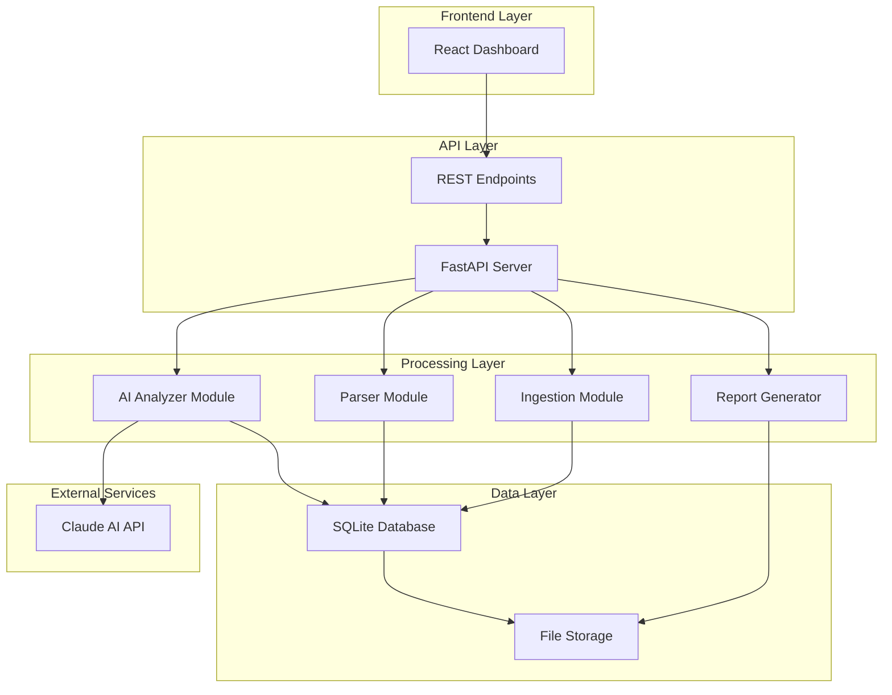
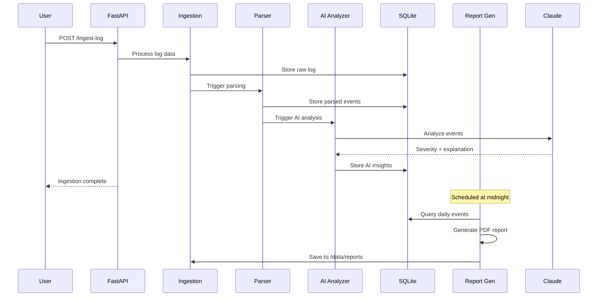

# Design Document

## Overview

ThreatLens is designed as a microservices-oriented application with a FastAPI backend, React frontend, and SQLite database. The system follows an event-driven architecture where log ingestion triggers automated parsing and AI analysis. The design emphasizes modularity, scalability, and real-time processing capabilities while maintaining simplicity for demo purposes.

## Architecture

### High-Level Architecture



### System Flow



## Components and Interfaces

### Backend Components

#### 1. FastAPI Application (`main.py`)
- **Purpose**: Main application entry point and API routing
- **Responsibilities**:
  - Initialize FastAPI app with CORS middleware
  - Define API routes and dependency injection
  - Handle request/response serialization
  - Manage application lifecycle and startup/shutdown events

#### 2. Ingestion Module (`ingestion.py`)
- **Purpose**: Handle log data intake and storage
- **Key Functions**:
  - `ingest_log_file(file: UploadFile) -> IngestionResult`
  - `ingest_log_text(text: str) -> IngestionResult`
  - `store_raw_log(data: str, source: str) -> str`
- **Interfaces**:
  - Input: Raw log files or text strings
  - Output: Ingestion ID and status
  - Triggers: Automatic parsing pipeline

#### 3. Parser Module (`parser.py`)
- **Purpose**: Transform raw logs into structured events
- **Key Functions**:
  - `parse_log_entries(raw_log: str) -> List[ParsedEvent]`
  - `extract_timestamp(log_line: str) -> datetime`
  - `categorize_event(message: str) -> EventCategory`
  - `apply_regex_patterns(line: str) -> Dict[str, str]`
- **Regex Patterns**:
  - macOS system.log: `r'(\w{3}\s+\d{1,2}\s+\d{2}:\d{2}:\d{2})\s+(\S+)\s+(.+)'`
  - Auth.log: `r'(\w{3}\s+\d{1,2}\s+\d{2}:\d{2}:\d{2})\s+(\S+)\s+(\w+)(?:\[(\d+)\])?\s*:\s*(.+)'`
- **Event Categories**: Authentication, Network, System, Application, Security

#### 4. AI Analyzer Module (`analyzer.py`)
- **Purpose**: Generate AI-powered insights for security events
- **Key Functions**:
  - `analyze_event(event: ParsedEvent) -> AIAnalysis`
  - `calculate_severity(event: ParsedEvent) -> int`
  - `generate_explanation(event: ParsedEvent) -> str`
  - `create_recommendations(event: ParsedEvent) -> List[str]`
- **Claude Integration**:
  - Model: Claude Sonnet 3.5/4.0
  - Input format: Structured event data (timestamp, source, message, category)
  - Output format: JSON with severity (1-10), explanation, recommendations
  - Error handling: Fallback to rule-based scoring on API failure

#### 5. Report Generator Module (`report_generator.py`)
- **Purpose**: Create PDF reports and visualizations
- **Key Functions**:
  - `generate_daily_report(date: datetime) -> bytes`
  - `create_severity_chart(events: List[Event]) -> Image`
  - `format_event_summary(events: List[Event]) -> str`
- **Libraries**: ReportLab for PDF generation, Matplotlib for charts
- **Report Sections**: Executive summary, severity distribution, top events, recommendations

### Frontend Components

#### 1. Dashboard Component (`Dashboard.tsx`)
- **Purpose**: Main application interface
- **Features**:
  - Event table with sorting and filtering
  - Severity distribution bar chart
  - Real-time event updates
  - Export functionality

#### 2. Event Table Component (`EventTable.tsx`)
- **Purpose**: Display and filter security events
- **Features**:
  - Sortable columns (timestamp, severity, source, category)
  - Filter by severity range, date range, category
  - Pagination for large datasets
  - Click-to-expand for detailed view

#### 3. Event Detail Modal (`EventDetail.tsx`)
- **Purpose**: Show comprehensive event analysis
- **Content**:
  - Raw log message
  - AI-generated explanation
  - Severity score with visual indicator
  - Recommendations list
  - Related events (if applicable)

#### 4. Severity Chart Component (`SeverityChart.tsx`)
- **Purpose**: Visualize severity distribution
- **Implementation**: Chart.js or Recharts
- **Features**: Interactive bars, time-based filtering, drill-down capability

## Data Models

### Database Schema

```sql
-- Raw logs table
CREATE TABLE raw_logs (
    id TEXT PRIMARY KEY,
    content TEXT NOT NULL,
    source TEXT NOT NULL,
    ingested_at TIMESTAMP DEFAULT CURRENT_TIMESTAMP
);

-- Parsed events table
CREATE TABLE events (
    id TEXT PRIMARY KEY,
    raw_log_id TEXT REFERENCES raw_logs(id),
    timestamp TIMESTAMP NOT NULL,
    source TEXT NOT NULL,
    message TEXT NOT NULL,
    category TEXT NOT NULL,
    parsed_at TIMESTAMP DEFAULT CURRENT_TIMESTAMP
);

-- AI analysis table
CREATE TABLE ai_analysis (
    id TEXT PRIMARY KEY,
    event_id TEXT REFERENCES events(id),
    severity_score INTEGER NOT NULL CHECK (severity_score >= 1 AND severity_score <= 10),
    explanation TEXT NOT NULL,
    recommendations TEXT NOT NULL, -- JSON array
    analyzed_at TIMESTAMP DEFAULT CURRENT_TIMESTAMP
);

-- Reports table
CREATE TABLE reports (
    id TEXT PRIMARY KEY,
    report_date DATE NOT NULL,
    file_path TEXT NOT NULL,
    generated_at TIMESTAMP DEFAULT CURRENT_TIMESTAMP
);
```

### API Models

```python
# Pydantic models for API
class IngestionRequest(BaseModel):
    content: str
    source: str = "manual"

class ParsedEvent(BaseModel):
    id: str
    timestamp: datetime
    source: str
    message: str
    category: str

class AIAnalysis(BaseModel):
    severity_score: int = Field(ge=1, le=10)
    explanation: str
    recommendations: List[str]

class EventResponse(BaseModel):
    event: ParsedEvent
    analysis: AIAnalysis

class EventFilter(BaseModel):
    start_date: Optional[datetime] = None
    end_date: Optional[datetime] = None
    min_severity: Optional[int] = Field(None, ge=1, le=10)
    max_severity: Optional[int] = Field(None, ge=1, le=10)
    category: Optional[str] = None
    source: Optional[str] = None
```

## Error Handling

### API Error Responses
- **400 Bad Request**: Invalid input data, malformed requests
- **404 Not Found**: Event or resource not found
- **422 Unprocessable Entity**: Validation errors
- **500 Internal Server Error**: System failures, AI API errors
- **503 Service Unavailable**: Database connection issues

### Error Recovery Strategies
1. **AI Analysis Failures**: Fallback to rule-based severity scoring
2. **Database Failures**: Retry with exponential backoff, graceful degradation
3. **Parsing Failures**: Log error, continue with remaining entries
4. **Report Generation Failures**: Retry once, alert administrators

### Logging Strategy
- **Structured Logging**: JSON format with correlation IDs
- **Log Levels**: DEBUG (development), INFO (operations), WARN (recoverable errors), ERROR (failures)
- **Log Rotation**: Daily rotation with 30-day retention
- **Monitoring**: Health check endpoints for system status

## Testing Strategy

### Unit Testing
- **Backend**: pytest with fixtures for database and AI mocking
- **Frontend**: Jest and React Testing Library
- **Coverage Target**: 80% code coverage minimum
- **Test Categories**: Happy path, error conditions, edge cases

### Integration Testing
- **API Testing**: FastAPI TestClient for endpoint testing
- **Database Testing**: In-memory SQLite for isolated tests
- **AI Integration**: Mock Claude API responses for consistent testing
- **End-to-End**: Playwright for full user workflow testing

### Performance Testing
- **Load Testing**: Artillery.js for API endpoint stress testing
- **Database Performance**: Query optimization and indexing validation
- **Memory Usage**: Profiling for large log file processing
- **Response Times**: Target <200ms for API responses, <2s for AI analysis

### Security Testing
- **Input Validation**: SQL injection, XSS prevention testing
- **Authentication**: API key validation and rate limiting
- **Data Sanitization**: Log content sanitization to prevent code injection
- **File Upload Security**: File type validation and size limits

## Deployment Considerations

### Development Environment
- **Backend**: FastAPI with uvicorn, hot reload enabled
- **Frontend**: React with Vite dev server
- **Database**: Local SQLite file
- **AI Integration**: Direct Claude API calls with development API keys

### Production Considerations
- **Containerization**: Docker containers for backend and frontend
- **Database**: SQLite with WAL mode for better concurrency
- **Reverse Proxy**: Nginx for static file serving and API proxying
- **Monitoring**: Health checks, metrics collection, log aggregation
- **Backup Strategy**: Automated database backups and report archival