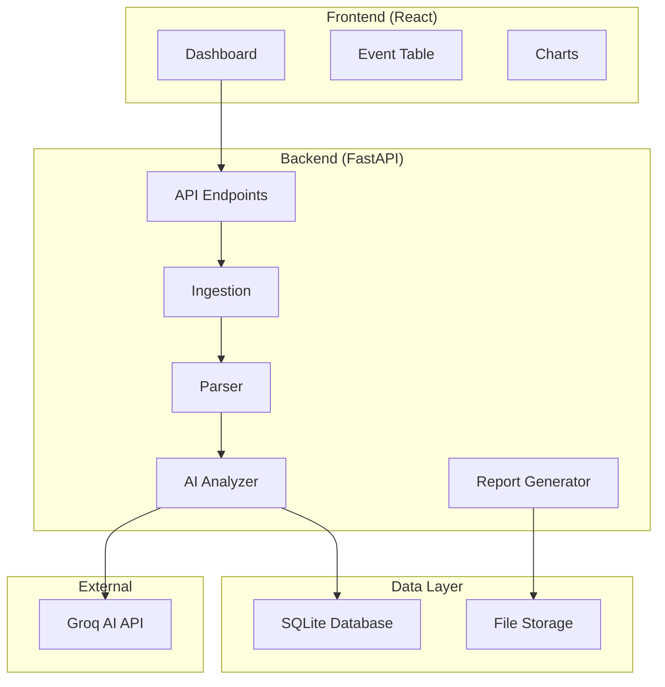

# ThreatLens

ThreatLens is an AI-powered security log analyzer that transforms raw security logs into actionable intelligence. It ingests security logs, parses them into structured events, applies AI-based severity scoring and explanations, and generates both a web dashboard and automated daily PDF reports.

## 🚀 Features

- **Log Ingestion**: Upload log files or paste log text through REST API
- **Intelligent Parsing**: Automatically parse macOS system.log and auth.log formats
- **AI Analysis**: Groq-powered severity scoring and explanations for security events
- **Web Dashboard**: Real-time visualization of security events with filtering and sorting
- **Automated Reports**: Daily PDF reports with event summaries and severity charts
- **Real-time Updates**: WebSocket-based live updates for new security events
- **Docker Support**: Containerized deployment for development and production

## 📋 Prerequisites

- **Docker & Docker Compose** (recommended)
- **Python 3.11+** (for local development)
- **Node.js 18+** (for frontend development)
- **Groq API Key** (for AI analysis)

## 🐳 Quick Start with Docker

The fastest way to get ThreatLens running:

```bash
# Clone the repository
git clone <repository-url>
cd threatlens

# Setup environment
cp .env.example .env
# Edit .env and add your GROQ_API_KEY

# Deploy with Docker
./scripts/deploy.sh development
```

Access the application:
- **Dashboard**: http://localhost:3000
- **API**: http://localhost:8000
- **API Documentation**: http://localhost:8000/docs

## 🛠️ Local Development Setup

For development without Docker:

```bash
# Run the development setup script
./scripts/dev-setup.sh

# Or manually:
python -m venv venv
source venv/bin/activate  # On Windows: venv\Scripts\activate
pip install -r requirements.txt
cp .env.example .env
# Edit .env with your GROQ_API_KEY
python setup_env.py

# Start backend
uvicorn main:app --reload

# Start frontend (in another terminal)
cd frontend
npm install
npm start
```

## 🎯 Demo

To see ThreatLens in action with sample data:

```bash
python demo_data_loader.py
```

This loads sample macOS security logs and demonstrates the AI analysis capabilities.

## 📚 API Documentation

### Authentication
Currently, ThreatLens operates without authentication for demo purposes. In production, implement proper API authentication.

### Endpoints

#### Log Ingestion
```http
POST /ingest-log
Content-Type: multipart/form-data or application/json

# File upload
curl -X POST "http://localhost:8000/ingest-log" \
  -F "file=@sample.log"

# Text input
curl -X POST "http://localhost:8000/ingest-log" \
  -H "Content-Type: application/json" \
  -d '{"content": "log content here", "source": "manual"}'
```

#### Event Retrieval
```http
GET /events?limit=50&offset=0&min_severity=5&category=auth

# Response
{
  "events": [
    {
      "id": "uuid",
      "timestamp": "2024-01-01T12:00:00Z",
      "source": "auth.log",
      "message": "Failed login attempt",
      "category": "authentication",
      "severity_score": 7,
      "explanation": "AI-generated explanation",
      "recommendations": ["recommendation1", "recommendation2"]
    }
  ],
  "total": 100,
  "limit": 50,
  "offset": 0
}
```

#### Event Details
```http
GET /event/{event_id}

# Response includes full AI analysis
{
  "event": {...},
  "analysis": {
    "severity_score": 7,
    "explanation": "Detailed AI explanation",
    "recommendations": ["action1", "action2"]
  }
}
```

#### Reports
```http
GET /report/daily?date=2024-01-01

# Returns PDF file
Content-Type: application/pdf
```

#### Health Check
```http
GET /health

# Response
{
  "status": "healthy",
  "database": "connected",
  "ai_service": "available",
  "timestamp": "2024-01-01T12:00:00Z"
}
```

### Query Parameters

#### Events Endpoint
- `limit` (int): Number of events to return (default: 50, max: 1000)
- `offset` (int): Number of events to skip (default: 0)
- `min_severity` (int): Minimum severity score (1-10)
- `max_severity` (int): Maximum severity score (1-10)
- `category` (string): Event category filter
- `source` (string): Event source filter
- `start_date` (ISO datetime): Events after this date
- `end_date` (ISO datetime): Events before this date

## 🏗️ Architecture

ThreatLens follows a modular, containerized architecture:



### Components

- **Frontend**: React with TypeScript, Tailwind CSS, Chart.js
- **Backend**: FastAPI with SQLAlchemy ORM, Pydantic validation
- **Database**: SQLite with WAL mode for better concurrency
- **AI Integration**: Groq API for event analysis
- **Reports**: ReportLab for PDF generation
- **Deployment**: Docker containers with nginx reverse proxy

## 🚀 Deployment

### Development
```bash
./scripts/deploy.sh development
```

### Production
```bash
# Setup production environment
cp .env.production .env
# Edit .env with production values

# Deploy
./scripts/deploy.sh production
```

### Environment Variables

#### Required
- `GROQ_API_KEY`: Your Groq API key for AI analysis

#### Optional
- `DATABASE_URL`: SQLite database path (default: sqlite:///data/threatlens.db)
- `LOG_LEVEL`: Logging level (default: INFO)
- `ENVIRONMENT`: Environment mode (development/production)
- `WORKERS`: Number of worker processes for production (default: 4)
- `MAX_UPLOAD_SIZE`: Maximum file upload size (default: 50MB)

## 🧪 Testing

### Backend Tests
```bash
# Run all tests
pytest

# Run with coverage
pytest --cov=app

# Run specific test file
pytest tests/test_analyzer.py
```

### Frontend Tests
```bash
cd frontend
npm test

# Run with coverage
npm test -- --coverage
```

### Integration Tests
```bash
# End-to-end tests
python tests/run_e2e_tests.py

# Performance tests
python tests/stress_test_realtime_system.py
```

## 📁 Project Structure

```
threatlens/
├── app/                    # Backend application
│   ├── models.py          # Database models
│   ├── ingestion.py       # Log ingestion logic
│   ├── parser.py          # Log parsing engine
│   ├── analyzer.py        # AI analysis integration
│   ├── report_generator.py # PDF report generation
│   ├── background_tasks.py # Scheduled tasks
│   └── realtime/          # Real-time processing
├── frontend/              # React frontend
│   ├── src/
│   │   ├── components/    # React components
│   │   ├── services/      # API services
│   │   ├── hooks/         # Custom hooks
│   │   └── types/         # TypeScript types
│   └── public/
├── data/                  # Database and reports
│   ├── reports/           # Generated PDF reports
│   └── sample_logs/       # Sample log files
├── tests/                 # Test files
├── scripts/               # Deployment scripts
├── docs/                  # Documentation
├── docker-compose.yml     # Development deployment
├── docker-compose.prod.yml # Production deployment
├── Dockerfile.backend     # Backend container
├── Dockerfile.frontend    # Frontend container
└── nginx.conf            # Nginx configuration
```

## 🔧 Configuration

### Database Configuration
ThreatLens uses SQLite by default. For production, consider:
- Enable WAL mode for better concurrency
- Regular backups using the provided backup script
- Monitor database size and implement cleanup policies

### AI Configuration
- **Groq Models**: Supports llama3-70b-8192, mixtral-8x7b-32768
- **Fallback**: Rule-based scoring when AI API is unavailable
- **Rate Limiting**: Respects Groq API rate limits

### Security Configuration
- Input sanitization for log content
- File upload validation and size limits
- CORS configuration for cross-origin requests
- Security headers in nginx configuration

## 📊 Monitoring

### Health Checks
- Backend: `GET /health`
- Database connectivity check
- AI service availability check
- Disk space monitoring

### Logging
- Structured JSON logging
- Log rotation and retention
- Error tracking and alerting
- Performance metrics

### Backup
```bash
# Create backup
./scripts/backup.sh

# Backups are stored in backups/ directory
# Automatic cleanup of old backups (7 days retention)
```

## 🤝 Contributing

1. Fork the repository
2. Create a feature branch: `git checkout -b feature/amazing-feature`
3. Make your changes
4. Add tests for new functionality
5. Run the test suite: `pytest && cd frontend && npm test`
6. Commit your changes: `git commit -m 'Add amazing feature'`
7. Push to the branch: `git push origin feature/amazing-feature`
8. Submit a pull request

### Development Guidelines
- Follow PEP 8 for Python code
- Use TypeScript for frontend development
- Write tests for new features
- Update documentation for API changes
- Use conventional commit messages

## 🐛 Troubleshooting

### Common Issues

#### Docker Issues
```bash
# Check Docker status
docker info

# View container logs
docker-compose logs backend
docker-compose logs frontend

# Restart services
docker-compose restart
```

#### Database Issues
```bash
# Reset database
rm data/threatlens.db
python setup_env.py
```

#### AI Analysis Issues
- Verify GROQ_API_KEY is set correctly
- Check API rate limits
- Review logs for API errors

#### Frontend Issues
```bash
# Clear npm cache
cd frontend
npm cache clean --force
rm -rf node_modules package-lock.json
npm install
```

### Performance Tuning
- Increase worker processes for production
- Enable database WAL mode
- Configure nginx caching
- Monitor memory usage

## 📄 License

MIT License - see LICENSE file for details.

## 🙏 Acknowledgments

- [FastAPI](https://fastapi.tiangolo.com/) for the excellent web framework
- [React](https://reactjs.org/) for the frontend framework
- [Groq](https://groq.com/) for AI analysis capabilities
- [ReportLab](https://www.reportlab.com/) for PDF generation