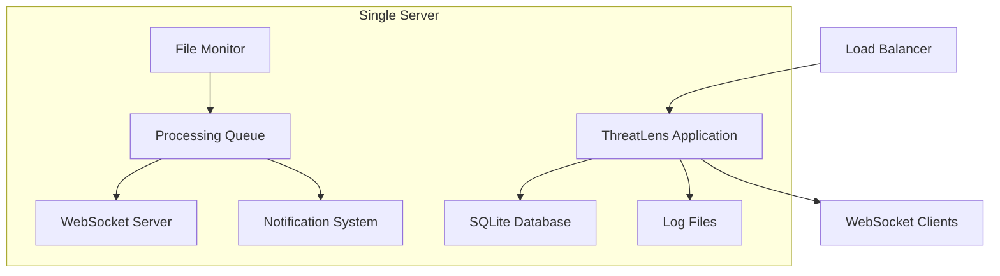
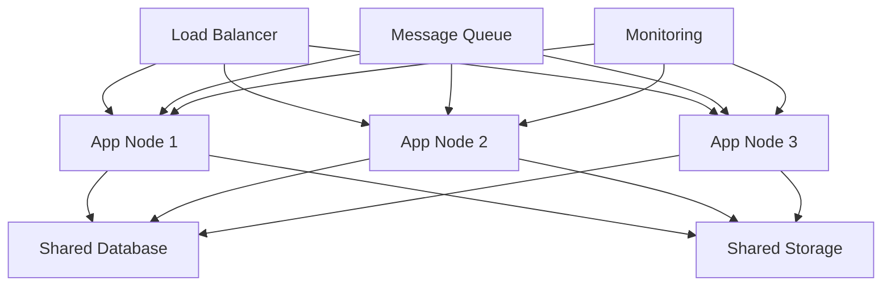

# ThreatLens Real-Time Monitoring Deployment Guide

## Overview

This guide provides comprehensive deployment instructions for ThreatLens real-time monitoring in production environments. It covers deployment strategies, infrastructure requirements, configuration management, and operational best practices.

## Table of Contents

1. [Deployment Architecture](#deployment-architecture)
2. [Infrastructure Requirements](#infrastructure-requirements)
3. [Deployment Strategies](#deployment-strategies)
4. [Production Deployment](#production-deployment)
5. [Container Deployment](#container-deployment)
6. [Cloud Deployment](#cloud-deployment)
7. [High Availability Setup](#high-availability-setup)
8. [Performance Optimization](#performance-optimization)
9. [Security Hardening](#security-hardening)
10. [Monitoring and Observability](#monitoring-and-observability)
11. [Backup and Recovery](#backup-and-recovery)
12. [Troubleshooting](#troubleshooting)

## Deployment Architecture

### Single Node Deployment



**Use Cases:**
- Small to medium organizations (< 10,000 events/day)
- Development and testing environments
- Proof of concept deployments

**Pros:**
- Simple setup and maintenance
- Lower resource requirements
- Cost-effective

**Cons:**
- Single point of failure
- Limited scalability
- Resource contention

### Multi-Node Deployment



**Use Cases:**
- Large organizations (> 10,000 events/day)
- High availability requirements
- Geographically distributed deployments

**Pros:**
- High availability
- Horizontal scalability
- Load distribution

**Cons:**
- Complex setup
- Higher resource requirements
- Network dependencies

## Infrastructure Requirements

### Minimum Production Requirements

| Component | Specification | Notes |
|-----------|---------------|-------|
| **CPU** | 4 cores @ 2.5GHz | Intel/AMD x64 architecture |
| **Memory** | 8 GB RAM | 16 GB recommended for high volume |
| **Storage** | 100 GB SSD | Fast I/O for database and logs |
| **Network** | 1 Gbps | Stable connection for real-time updates |
| **OS** | Ubuntu 20.04 LTS | CentOS 8, RHEL 8 also supported |

### Recommended Production Requirements

| Component | Specification | Notes |
|-----------|---------------|-------|
| **CPU** | 8 cores @ 3.0GHz | Better performance for AI analysis |
| **Memory** | 32 GB RAM | Supports larger queues and caching |
| **Storage** | 500 GB NVMe SSD | High IOPS for database operations |
| **Network** | 10 Gbps | Low latency for real-time processing |
| **OS** | Ubuntu 22.04 LTS | Latest LTS with security updates |

### High-Volume Requirements (> 100,000 events/day)

| Component | Specification | Notes |
|-----------|---------------|-------|
| **CPU** | 16+ cores @ 3.5GHz | Multi-node deployment recommended |
| **Memory** | 64+ GB RAM | Large memory for processing buffers |
| **Storage** | 1+ TB NVMe SSD | Consider database partitioning |
| **Network** | 25+ Gbps | Dedicated network for log ingestion |
| **Database** | PostgreSQL cluster | SQLite not recommended at this scale |

### Storage Requirements

#### Database Storage

```bash
# Estimate database growth
# Base formula: events_per_day * average_event_size * retention_days

# Example calculations:
# Small deployment: 1,000 events/day * 2KB * 365 days = ~730 MB/year
# Medium deployment: 10,000 events/day * 2KB * 365 days = ~7.3 GB/year  
# Large deployment: 100,000 events/day * 2KB * 365 days = ~73 GB/year

# Add 50% buffer for indexes, metadata, and growth
# Small: 1.1 GB/year
# Medium: 11 GB/year
# Large: 110 GB/year
```

#### Log File Storage

```bash
# Raw log retention (optional)
# Formula: log_volume_per_day * retention_days * compression_ratio

# Example with 10GB/day logs, 30-day retention, 70% compression:
# 10 GB * 30 * 0.3 = 90 GB for raw log storage
```

### Network Requirements

#### Bandwidth Estimation

```bash
# Real-time processing bandwidth
# Formula: events_per_second * average_event_size * overhead_factor

# Example for 10 events/second, 2KB average size, 2x overhead:
# 10 * 2KB * 2 = 40 KB/s baseline
# Peak load (10x): 400 KB/s
# WebSocket updates: Additional 50-100 KB/s per connected client
```

#### Port Requirements

| Port | Protocol | Purpose | External Access |
|------|----------|---------|-----------------|
| 8000 | HTTP/HTTPS | Main API and Web UI | Yes |
| 8000 | WebSocket | Real-time updates | Yes |
| 9090 | HTTP | Prometheus metrics | Internal only |
| 5432 | TCP | PostgreSQL (if used) | Internal only |
| 22 | SSH | System administration | Restricted |

## Deployment Strategies

### Blue-Green Deployment

```bash
#!/bin/bash
# Blue-Green deployment script

BLUE_ENV="threatlens-blue"
GREEN_ENV="threatlens-green"
CURRENT_ENV=$(cat /etc/threatlens/current_env)

if [ "$CURRENT_ENV" = "$BLUE_ENV" ]; then
    TARGET_ENV=$GREEN_ENV
    SOURCE_ENV=$BLUE_ENV
else
    TARGET_ENV=$BLUE_ENV
    SOURCE_ENV=$GREEN_ENV
fi

echo "Deploying to $TARGET_ENV environment..."

# Deploy new version to target environment
docker-compose -f docker-compose.$TARGET_ENV.yml up -d

# Wait for health check
sleep 30
if curl -f http://localhost:8001/api/health; then
    echo "Health check passed, switching traffic..."
    
    # Update load balancer configuration
    sed -i "s/$SOURCE_ENV/$TARGET_ENV/g" /etc/nginx/sites-available/threatlens
    nginx -s reload
    
    # Update current environment marker
    echo $TARGET_ENV > /etc/threatlens/current_env
    
    # Stop old environment
    docker-compose -f docker-compose.$SOURCE_ENV.yml down
    
    echo "Deployment completed successfully"
else
    echo "Health check failed, rolling back..."
    docker-compose -f docker-compose.$TARGET_ENV.yml down
    exit 1
fi
```

### Rolling Deployment

```bash
#!/bin/bash
# Rolling deployment for multi-node setup

NODES=("node1" "node2" "node3")
NEW_VERSION=$1

for node in "${NODES[@]}"; do
    echo "Updating $node..."
    
    # Remove node from load balancer
    curl -X POST "http://loadbalancer/api/nodes/$node/disable"
    
    # Wait for connections to drain
    sleep 30
    
    # Update node
    ssh $node "cd /opt/threatlens && git pull && docker-compose up -d --no-deps app"
    
    # Wait for node to be ready
    sleep 60
    
    # Health check
    if ssh $node "curl -f http://localhost:8000/api/health"; then
        # Re-enable node in load balancer
        curl -X POST "http://loadbalancer/api/nodes/$node/enable"
        echo "$node updated successfully"
    else
        echo "$node update failed, manual intervention required"
        exit 1
    fi
done
```

### Canary Deployment

```bash
#!/bin/bash
# Canary deployment script

CANARY_PERCENTAGE=10
NEW_VERSION=$1

echo "Starting canary deployment for version $NEW_VERSION..."

# Deploy canary version
docker run -d --name threatlens-canary \
    -p 8001:8000 \
    -v /opt/threatlens/config:/app/config \
    -v /opt/threatlens/data:/app/data \
    threatlens:$NEW_VERSION

# Configure load balancer for canary traffic
cat > /etc/nginx/conf.d/canary.conf << EOF
upstream threatlens_canary {
    server localhost:8000 weight=$((100-CANARY_PERCENTAGE));
    server localhost:8001 weight=$CANARY_PERCENTAGE;
}
EOF

nginx -s reload

echo "Canary deployment active with $CANARY_PERCENTAGE% traffic"
echo "Monitor metrics and run 'promote_canary.sh' or 'rollback_canary.sh'"
```

## Production Deployment

### System Preparation

```bash
#!/bin/bash
# Production system preparation script

# Update system
apt update && apt upgrade -y

# Install required packages
apt install -y \
    python3.9 \
    python3.9-pip \
    python3.9-venv \
    python3.9-dev \
    build-essential \
    libssl-dev \
    libffi-dev \
    libevent-dev \
    libsqlite3-dev \
    nginx \
    supervisor \
    logrotate \
    fail2ban \
    ufw

# Create system user
useradd -r -s /bin/bash -d /opt/threatlens -m threatlens

# Create directory structure
mkdir -p /opt/threatlens/{app,config,data,logs,backups}
chown -R threatlens:threatlens /opt/threatlens

# Set up log directories
mkdir -p /var/log/threatlens
chown threatlens:threatlens /var/log/threatlens

# Configure log rotation
cat > /etc/logrotate.d/threatlens << 'EOF'
/var/log/threatlens/*.log {
    daily
    rotate 30
    compress
    delaycompress
    missingok
    notifempty
    create 644 threatlens threatlens
    postrotate
        systemctl reload threatlens
    endscript
}
EOF
```

### Application Deployment

```bash
#!/bin/bash
# Application deployment script

cd /opt/threatlens

# Clone or update application
if [ -d "app/.git" ]; then
    cd app && git pull
else
    git clone https://github.com/your-org/threatlens.git app
    cd app
fi

# Create virtual environment
python3.9 -m venv venv
source venv/bin/activate

# Install dependencies
pip install --upgrade pip setuptools wheel
pip install -r requirements.txt

# Install production dependencies
pip install \
    gunicorn==21.2.0 \
    gevent==23.7.0 \
    psycopg2-binary==2.9.7 \
    redis==4.6.0

# Set up configuration
cp .env.example .env.production
chown threatlens:threatlens .env.production
chmod 600 .env.production

# Initialize database
python app/init_db.py
python -m app.migrations.runner

# Set permissions
chown -R threatlens:threatlens /opt/threatlens
chmod +x /opt/threatlens/app/scripts/*.sh
```

### Service Configuration

```bash
# Create systemd service
cat > /etc/systemd/system/threatlens.service << 'EOF'
[Unit]
Description=ThreatLens Real-Time Log Monitoring
After=network.target postgresql.service redis.service
Wants=postgresql.service redis.service

[Service]
Type=notify
User=threatlens
Group=threatlens
WorkingDirectory=/opt/threatlens/app
Environment=PATH=/opt/threatlens/app/venv/bin
Environment=PYTHONPATH=/opt/threatlens/app
EnvironmentFile=/opt/threatlens/app/.env.production

ExecStart=/opt/threatlens/app/venv/bin/gunicorn \
    --bind 127.0.0.1:8000 \
    --workers 4 \
    --worker-class gevent \
    --worker-connections 1000 \
    --timeout 30 \
    --keepalive 2 \
    --max-requests 1000 \
    --max-requests-jitter 100 \
    --preload \
    --access-logfile /var/log/threatlens/access.log \
    --error-logfile /var/log/threatlens/error.log \
    --log-level info \
    main:app

ExecReload=/bin/kill -s HUP $MAINPID
KillMode=mixed
TimeoutStopSec=5
PrivateTmp=true
ProtectSystem=strict
ProtectHome=true
ReadWritePaths=/opt/threatlens /var/log/threatlens
NoNewPrivileges=true

Restart=always
RestartSec=10

[Install]
WantedBy=multi-user.target
EOF

# Enable and start service
systemctl daemon-reload
systemctl enable threatlens
systemctl start threatlens
```

### Nginx Configuration

```nginx
# /etc/nginx/sites-available/threatlens
server {
    listen 80;
    server_name your-domain.com;
    return 301 https://$server_name$request_uri;
}

server {
    listen 443 ssl http2;
    server_name your-domain.com;

    # SSL Configuration
    ssl_certificate /etc/ssl/certs/threatlens.crt;
    ssl_certificate_key /etc/ssl/private/threatlens.key;
    ssl_protocols TLSv1.2 TLSv1.3;
    ssl_ciphers ECDHE-RSA-AES256-GCM-SHA384:ECDHE-RSA-AES128-GCM-SHA256;
    ssl_prefer_server_ciphers off;
    ssl_session_cache shared:SSL:10m;
    ssl_session_timeout 10m;

    # Security Headers
    add_header X-Frame-Options DENY;
    add_header X-Content-Type-Options nosniff;
    add_header X-XSS-Protection "1; mode=block";
    add_header Strict-Transport-Security "max-age=31536000; includeSubDomains";
    add_header Content-Security-Policy "default-src 'self'; script-src 'self' 'unsafe-inline'; style-src 'self' 'unsafe-inline';";

    # Rate Limiting
    limit_req_zone $binary_remote_addr zone=api:10m rate=10r/s;
    limit_req_zone $binary_remote_addr zone=websocket:10m rate=5r/s;

    # Main application
    location / {
        limit_req zone=api burst=20 nodelay;
        
        proxy_pass http://127.0.0.1:8000;
        proxy_set_header Host $host;
        proxy_set_header X-Real-IP $remote_addr;
        proxy_set_header X-Forwarded-For $proxy_add_x_forwarded_for;
        proxy_set_header X-Forwarded-Proto $scheme;
        
        proxy_connect_timeout 30s;
        proxy_send_timeout 30s;
        proxy_read_timeout 30s;
        
        proxy_buffering on;
        proxy_buffer_size 4k;
        proxy_buffers 8 4k;
    }

    # WebSocket endpoint
    location /ws {
        limit_req zone=websocket burst=10 nodelay;
        
        proxy_pass http://127.0.0.1:8000;
        proxy_http_version 1.1;
        proxy_set_header Upgrade $http_upgrade;
        proxy_set_header Connection "upgrade";
        proxy_set_header Host $host;
        proxy_set_header X-Real-IP $remote_addr;
        proxy_set_header X-Forwarded-For $proxy_add_x_forwarded_for;
        proxy_set_header X-Forwarded-Proto $scheme;
        
        proxy_connect_timeout 7d;
        proxy_send_timeout 7d;
        proxy_read_timeout 7d;
    }

    # Static files (if serving directly)
    location /static/ {
        alias /opt/threatlens/app/static/;
        expires 1y;
        add_header Cache-Control "public, immutable";
    }

    # Health check endpoint (no rate limiting)
    location /api/health {
        proxy_pass http://127.0.0.1:8000;
        access_log off;
    }

    # Metrics endpoint (internal only)
    location /metrics {
        allow 127.0.0.1;
        allow 10.0.0.0/8;
        deny all;
        proxy_pass http://127.0.0.1:8000;
    }
}
```

## Container Deployment

### Docker Configuration

```dockerfile
# Dockerfile.production
FROM python:3.9-slim

# Install system dependencies
RUN apt-get update && apt-get install -y \
    build-essential \
    libssl-dev \
    libffi-dev \
    libevent-dev \
    libsqlite3-dev \
    && rm -rf /var/lib/apt/lists/*

# Create application user
RUN useradd -r -s /bin/bash -d /app threatlens

# Set working directory
WORKDIR /app

# Copy requirements and install Python dependencies
COPY requirements.txt .
RUN pip install --no-cache-dir -r requirements.txt

# Copy application code
COPY . .

# Set ownership
RUN chown -R threatlens:threatlens /app

# Switch to application user
USER threatlens

# Expose port
EXPOSE 8000

# Health check
HEALTHCHECK --interval=30s --timeout=10s --start-period=5s --retries=3 \
    CMD curl -f http://localhost:8000/api/health || exit 1

# Start application
CMD ["gunicorn", "--bind", "0.0.0.0:8000", "--workers", "4", "--worker-class", "gevent", "main:app"]
```

### Docker Compose Configuration

```yaml
# docker-compose.production.yml
version: '3.8'

services:
  app:
    build:
      context: .
      dockerfile: Dockerfile.production
    ports:
      - "8000:8000"
    environment:
      - DATABASE_URL=postgresql://threatlens:${DB_PASSWORD}@db:5432/threatlens
      - REDIS_URL=redis://redis:6379/0
    volumes:
      - ./config:/app/config:ro
      - ./data:/app/data
      - ./logs:/app/logs
      - /var/log:/var/log:ro  # For log monitoring
    depends_on:
      - db
      - redis
    restart: unless-stopped
    healthcheck:
      test: ["CMD", "curl", "-f", "http://localhost:8000/api/health"]
      interval: 30s
      timeout: 10s
      retries: 3
      start_period: 40s

  db:
    image: postgres:15
    environment:
      - POSTGRES_DB=threatlens
      - POSTGRES_USER=threatlens
      - POSTGRES_PASSWORD=${DB_PASSWORD}
    volumes:
      - postgres_data:/var/lib/postgresql/data
      - ./scripts/init-db.sql:/docker-entrypoint-initdb.d/init-db.sql
    restart: unless-stopped
    healthcheck:
      test: ["CMD-SHELL", "pg_isready -U threatlens"]
      interval: 10s
      timeout: 5s
      retries: 5

  redis:
    image: redis:7-alpine
    command: redis-server --appendonly yes
    volumes:
      - redis_data:/data
    restart: unless-stopped
    healthcheck:
      test: ["CMD", "redis-cli", "ping"]
      interval: 10s
      timeout: 3s
      retries: 3

  nginx:
    image: nginx:alpine
    ports:
      - "80:80"
      - "443:443"
    volumes:
      - ./nginx.conf:/etc/nginx/nginx.conf:ro
      - ./ssl:/etc/ssl:ro
    depends_on:
      - app
    restart: unless-stopped

volumes:
  postgres_data:
  redis_data:
```

### Kubernetes Deployment

```yaml
# k8s-deployment.yml
apiVersion: apps/v1
kind: Deployment
metadata:
  name: threatlens
  labels:
    app: threatlens
spec:
  replicas: 3
  selector:
    matchLabels:
      app: threatlens
  template:
    metadata:
      labels:
        app: threatlens
    spec:
      containers:
      - name: threatlens
        image: threatlens:latest
        ports:
        - containerPort: 8000
        env:
        - name: DATABASE_URL
          valueFrom:
            secretKeyRef:
              name: threatlens-secrets
              key: database-url
        - name: API_KEY
          valueFrom:
            secretKeyRef:
              name: threatlens-secrets
              key: api-key
        volumeMounts:
        - name: config
          mountPath: /app/config
        - name: data
          mountPath: /app/data
        - name: logs
          mountPath: /var/log
          readOnly: true
        resources:
          requests:
            memory: "1Gi"
            cpu: "500m"
          limits:
            memory: "2Gi"
            cpu: "1000m"
        livenessProbe:
          httpGet:
            path: /api/health
            port: 8000
          initialDelaySeconds: 30
          periodSeconds: 10
        readinessProbe:
          httpGet:
            path: /api/health
            port: 8000
          initialDelaySeconds: 5
          periodSeconds: 5
      volumes:
      - name: config
        configMap:
          name: threatlens-config
      - name: data
        persistentVolumeClaim:
          claimName: threatlens-data
      - name: logs
        hostPath:
          path: /var/log
---
apiVersion: v1
kind: Service
metadata:
  name: threatlens-service
spec:
  selector:
    app: threatlens
  ports:
  - protocol: TCP
    port: 80
    targetPort: 8000
  type: LoadBalancer
```

## Cloud Deployment

### AWS Deployment

```bash
#!/bin/bash
# AWS deployment script using EC2 and RDS

# Create VPC and security groups
aws ec2 create-vpc --cidr-block 10.0.0.0/16 --tag-specifications 'ResourceType=vpc,Tags=[{Key=Name,Value=threatlens-vpc}]'

# Create RDS instance
aws rds create-db-instance \
    --db-instance-identifier threatlens-db \
    --db-instance-class db.t3.medium \
    --engine postgres \
    --master-username threatlens \
    --master-user-password ${DB_PASSWORD} \
    --allocated-storage 100 \
    --storage-type gp2 \
    --vpc-security-group-ids sg-xxxxxxxxx \
    --db-subnet-group-name threatlens-subnet-group \
    --backup-retention-period 7 \
    --multi-az \
    --storage-encrypted

# Launch EC2 instances
aws ec2 run-instances \
    --image-id ami-0c02fb55956c7d316 \
    --count 2 \
    --instance-type t3.large \
    --key-name threatlens-key \
    --security-group-ids sg-xxxxxxxxx \
    --subnet-id subnet-xxxxxxxxx \
    --user-data file://user-data.sh \
    --tag-specifications 'ResourceType=instance,Tags=[{Key=Name,Value=threatlens-app}]'

# Create Application Load Balancer
aws elbv2 create-load-balancer \
    --name threatlens-alb \
    --subnets subnet-xxxxxxxxx subnet-yyyyyyyyy \
    --security-groups sg-xxxxxxxxx
```

### Azure Deployment

```bash
#!/bin/bash
# Azure deployment script

# Create resource group
az group create --name threatlens-rg --location eastus

# Create virtual network
az network vnet create \
    --resource-group threatlens-rg \
    --name threatlens-vnet \
    --address-prefix 10.0.0.0/16 \
    --subnet-name threatlens-subnet \
    --subnet-prefix 10.0.1.0/24

# Create PostgreSQL server
az postgres server create \
    --resource-group threatlens-rg \
    --name threatlens-db \
    --location eastus \
    --admin-user threatlens \
    --admin-password ${DB_PASSWORD} \
    --sku-name GP_Gen5_2 \
    --storage-size 102400 \
    --backup-retention 7 \
    --geo-redundant-backup Enabled

# Create virtual machine scale set
az vmss create \
    --resource-group threatlens-rg \
    --name threatlens-vmss \
    --image UbuntuLTS \
    --upgrade-policy-mode automatic \
    --instance-count 2 \
    --admin-username azureuser \
    --ssh-key-values ~/.ssh/id_rsa.pub \
    --custom-data cloud-init.yml

# Create load balancer
az network lb create \
    --resource-group threatlens-rg \
    --name threatlens-lb \
    --sku Standard \
    --public-ip-address threatlens-pip \
    --frontend-ip-name threatlens-frontend \
    --backend-pool-name threatlens-backend
```

### GCP Deployment

```bash
#!/bin/bash
# GCP deployment script

# Create VPC network
gcloud compute networks create threatlens-vpc --subnet-mode regional

# Create subnet
gcloud compute networks subnets create threatlens-subnet \
    --network threatlens-vpc \
    --range 10.0.1.0/24 \
    --region us-central1

# Create Cloud SQL instance
gcloud sql instances create threatlens-db \
    --database-version POSTGRES_13 \
    --tier db-custom-2-4096 \
    --region us-central1 \
    --storage-size 100GB \
    --storage-type SSD \
    --backup-start-time 02:00 \
    --enable-bin-log

# Create instance template
gcloud compute instance-templates create threatlens-template \
    --machine-type n1-standard-2 \
    --image-family ubuntu-2004-lts \
    --image-project ubuntu-os-cloud \
    --subnet threatlens-subnet \
    --metadata-from-file startup-script=startup.sh \
    --tags threatlens-app

# Create managed instance group
gcloud compute instance-groups managed create threatlens-group \
    --template threatlens-template \
    --size 2 \
    --zone us-central1-a

# Create load balancer
gcloud compute backend-services create threatlens-backend \
    --protocol HTTP \
    --health-checks threatlens-health-check \
    --global

gcloud compute url-maps create threatlens-map \
    --default-service threatlens-backend

gcloud compute target-http-proxies create threatlens-proxy \
    --url-map threatlens-map

gcloud compute forwarding-rules create threatlens-rule \
    --global \
    --target-http-proxy threatlens-proxy \
    --ports 80
```

## High Availability Setup

### Database High Availability

```bash
# PostgreSQL Master-Slave Setup
# Master configuration (postgresql.conf)
cat >> /etc/postgresql/13/main/postgresql.conf << 'EOF'
# Replication settings
wal_level = replica
max_wal_senders = 3
max_replication_slots = 3
synchronous_commit = on
synchronous_standby_names = 'standby1'

# Archive settings
archive_mode = on
archive_command = 'cp %p /var/lib/postgresql/13/main/archive/%f'
EOF

# Slave configuration
cat >> /etc/postgresql/13/main/postgresql.conf << 'EOF'
# Standby settings
hot_standby = on
max_standby_streaming_delay = 30s
wal_receiver_status_interval = 10s
hot_standby_feedback = on
EOF

# Create replication user
sudo -u postgres psql << 'EOF'
CREATE USER replicator REPLICATION LOGIN CONNECTION LIMIT 3 ENCRYPTED PASSWORD 'replication_password';
EOF
```

### Application High Availability

```bash
# HAProxy configuration for application load balancing
cat > /etc/haproxy/haproxy.cfg << 'EOF'
global
    daemon
    maxconn 4096
    log stdout local0

defaults
    mode http
    timeout connect 5000ms
    timeout client 50000ms
    timeout server 50000ms
    option httplog
    option dontlognull
    option redispatch
    retries 3

frontend threatlens_frontend
    bind *:80
    bind *:443 ssl crt /etc/ssl/certs/threatlens.pem
    redirect scheme https if !{ ssl_fc }
    default_backend threatlens_backend

backend threatlens_backend
    balance roundrobin
    option httpchk GET /api/health
    http-check expect status 200
    
    server app1 10.0.1.10:8000 check inter 5s fall 3 rise 2
    server app2 10.0.1.11:8000 check inter 5s fall 3 rise 2
    server app3 10.0.1.12:8000 check inter 5s fall 3 rise 2

# WebSocket backend with sticky sessions
backend threatlens_websocket
    balance source
    option httpchk GET /api/health
    
    server app1 10.0.1.10:8000 check inter 5s fall 3 rise 2
    server app2 10.0.1.11:8000 check inter 5s fall 3 rise 2
    server app3 10.0.1.12:8000 check inter 5s fall 3 rise 2
EOF
```

### Shared Storage Setup

```bash
# NFS setup for shared configuration and logs
# On NFS server
apt install nfs-kernel-server
mkdir -p /export/threatlens/{config,logs}
chown -R threatlens:threatlens /export/threatlens

cat >> /etc/exports << 'EOF'
/export/threatlens 10.0.1.0/24(rw,sync,no_subtree_check,no_root_squash)
EOF

exportfs -ra
systemctl restart nfs-kernel-server

# On application servers
apt install nfs-common
mkdir -p /opt/threatlens/{config,logs}

cat >> /etc/fstab << 'EOF'
10.0.1.100:/export/threatlens/config /opt/threatlens/config nfs defaults 0 0
10.0.1.100:/export/threatlens/logs /opt/threatlens/logs nfs defaults 0 0
EOF

mount -a
```

## Performance Optimization

### System-Level Optimizations

```bash
# Kernel parameter tuning
cat >> /etc/sysctl.conf << 'EOF'
# Network optimizations
net.core.rmem_max = 134217728
net.core.wmem_max = 134217728
net.ipv4.tcp_rmem = 4096 65536 134217728
net.ipv4.tcp_wmem = 4096 65536 134217728
net.core.netdev_max_backlog = 5000
net.ipv4.tcp_congestion_control = bbr

# File system optimizations
fs.file-max = 65536
fs.inotify.max_user_watches = 524288
fs.inotify.max_user_instances = 256

# Memory management
vm.swappiness = 10
vm.dirty_ratio = 15
vm.dirty_background_ratio = 5
EOF

sysctl -p

# Increase file descriptor limits
cat >> /etc/security/limits.conf << 'EOF'
threatlens soft nofile 65536
threatlens hard nofile 65536
threatlens soft nproc 32768
threatlens hard nproc 32768
EOF
```

### Database Optimizations

```sql
-- PostgreSQL performance tuning
-- In postgresql.conf

-- Memory settings
shared_buffers = 256MB                  -- 25% of RAM
effective_cache_size = 1GB              -- 75% of RAM
work_mem = 4MB                          -- Per connection
maintenance_work_mem = 64MB

-- Checkpoint settings
checkpoint_completion_target = 0.9
wal_buffers = 16MB
checkpoint_timeout = 10min

-- Query planner
random_page_cost = 1.1                  -- For SSD storage
effective_io_concurrency = 200          -- For SSD storage

-- Connection settings
max_connections = 100
shared_preload_libraries = 'pg_stat_statements'

-- Create indexes for common queries
CREATE INDEX CONCURRENTLY idx_events_timestamp ON events(timestamp);
CREATE INDEX CONCURRENTLY idx_events_severity ON events(severity);
CREATE INDEX CONCURRENTLY idx_events_category ON events(category);
CREATE INDEX CONCURRENTLY idx_events_source ON events(source);
CREATE INDEX CONCURRENTLY idx_events_realtime ON events(realtime_processed, timestamp);

-- Partitioning for large tables
CREATE TABLE events_y2024m01 PARTITION OF events
    FOR VALUES FROM ('2024-01-01') TO ('2024-02-01');
CREATE TABLE events_y2024m02 PARTITION OF events
    FOR VALUES FROM ('2024-02-01') TO ('2024-03-01');
-- Continue for each month...
```

### Application Optimizations

```python
# gunicorn configuration (gunicorn.conf.py)
import multiprocessing

# Server socket
bind = "0.0.0.0:8000"
backlog = 2048

# Worker processes
workers = multiprocessing.cpu_count() * 2 + 1
worker_class = "gevent"
worker_connections = 1000
max_requests = 1000
max_requests_jitter = 100

# Timeout settings
timeout = 30
keepalive = 2
graceful_timeout = 30

# Logging
accesslog = "/var/log/threatlens/access.log"
errorlog = "/var/log/threatlens/error.log"
loglevel = "info"
access_log_format = '%(h)s %(l)s %(u)s %(t)s "%(r)s" %(s)s %(b)s "%(f)s" "%(a)s" %(D)s'

# Process naming
proc_name = "threatlens"

# Server mechanics
preload_app = True
daemon = False
pidfile = "/var/run/threatlens.pid"
user = "threatlens"
group = "threatlens"
tmp_upload_dir = None

# SSL (if terminating SSL at application level)
# keyfile = "/etc/ssl/private/threatlens.key"
# certfile = "/etc/ssl/certs/threatlens.crt"
```

This deployment guide provides comprehensive instructions for deploying ThreatLens in production environments with proper security, performance, and reliability considerations. Choose the deployment strategy that best fits your organization's requirements and infrastructure.